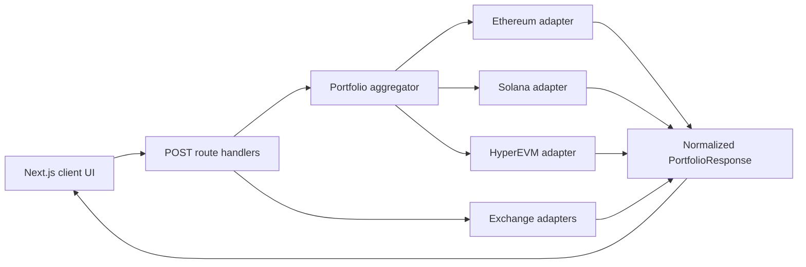

# ATH, Again

What would your crypto portfolio be worth if every asset you still hold revisited its all-time high?

[Live demo](https://ath-again.vercel.app) · [Architecture](docs/architecture.md) · [Security](SECURITY.md)

ATH, Again is a small, deliberately playful portfolio calculator. Paste a public address, connect a standards-compatible browser wallet, or make a one-time read-only exchange request. The app discovers current holdings, normalizes them across sources, and calculates a counterfactual value using each asset's historical USD ATH.

## What it supports

| Source | Current coverage | Connection model |
| --- | --- | --- |
| Browser wallets | Ethereum, Solana, native HYPE on HyperEVM | EIP-6963 + Wallet Standard |
| Pasted addresses | Ethereum/HyperEVM or Solana/SPL | Public address only |
| Bitvavo | Spot balances and available staking | One-time read-only API request |
| Binance | Spot balances | One-time read-only API request |

Wallet discovery is provider-independent: Phantom, MetaMask, Keplr, HashPack, and other compatible wallets are discovered through standards rather than vendor SDKs.

## Stack

- Next.js 16 App Router and React 19
- TypeScript with strict mode
- Wallet Standard and EIP-6963 wallet discovery
- Blockscout, Solana JSON-RPC, HyperEVM JSON-RPC, DEX Screener, and CoinGecko
- Lucide React icons
- Vitest, ESLint, GitHub Actions, and Vercel

## Architecture



Chain-specific code is isolated under `src/lib/portfolio/`. Every adapter returns the same normalized asset and portfolio shapes, so the UI never needs to understand token accounts, ERC-20 decimals, UTXOs, or exchange response formats.

## Local development

Requirements: Node.js 22+ and npm.

```bash
cp .env.example .env.local
npm install
npm run dev
```

Environment variables are optional:

- `COINGECKO_DEMO_API_KEY` improves free-tier price API reliability.
- `SOLANA_RPC_URL` replaces the public Solana mainnet endpoint.

## Quality checks

```bash
npm run lint
npm test
npm run build
```

The same checks run in GitHub Actions for pushes and pull requests.

## Security and accuracy

Exchange credentials exist only in request memory and are discarded when the request completes. Use dedicated keys with balance-reading permissions only; never enable trading or withdrawals.

The result is an estimate, not financial or tax advice. Token identity can be ambiguous, low-value or unpriced assets may be omitted, and the assets' all-time highs occurred on different dates. The total is intentionally counterfactual—it is not a historical portfolio snapshot.

## Roadmap

- Base and Polygon token adapters
- Bitcoin address support
- Better canonical asset identity for exchange symbols
- Rate limiting and abuse protection before broader public use

MIT licensed.
